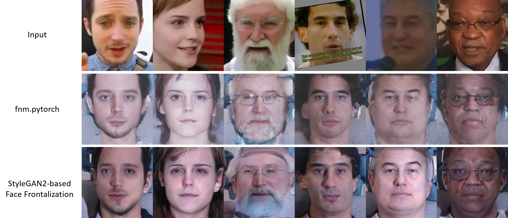

# StyleGAN2-based Face Frontalization Model

Here are some examples made by our face frontalization model.



Pre-requisites
-- 
- python3
- CUDA 10.0 or higher
- Install the [StyleGAN2](https://github.com/rosinality/stylegan2-pytorch) environment following the instruction.

Datasets
--
- Download face dataset such as CAISA-WebFace, VGGFace2, and MS-Celeb-1M as source set, and you can use any constrained (in-the-house) dataset as normal set.
- All face images are normalized to 250x250 according to landmarks. According to the five facial points, please follow the align protocol in [LightCNN](https://github.com/AlfredXiangWu/LightCNN). We also provide the crop code (MTCNN) as shown below.

Training and Inference 
--

**Preprocessing**

1. Change the directrory to **/FaceAlignment/** (*cd FaceAlignment*), and crop and align the input face images by running:
2. Pack the cropped data to the lmdb file by running:

    ```python prepare_data.py --out {LMDB file} --csv {the csv file}```

**Data Preparation**
1. Colone the Repository to preserve Directory Strcuture. 
2. Download the [face expert model](https://drive.google.com/drive/folders/1V7oMdPm2gmoBXKLsHrlzD0Gx2yAyk8qZ?usp=sharing), and put the model in **/Pretrained/VGGFace2/** directory. 
3. Train the face normalization model by running:

    ```python train.py --path_src {the source set} --path_norm {the target set}```


To-do list
--
- [x] Release the training code. 
- [ ] Release the evaluation code.
- [ ] Release the pre-trained model.

Acknowledgement
- The structures of the generator and the discriminator are borrowed from [StyleGAN2]().
- The idea of MultiPIE-like face frontalization is borrowed by [FNM]().

